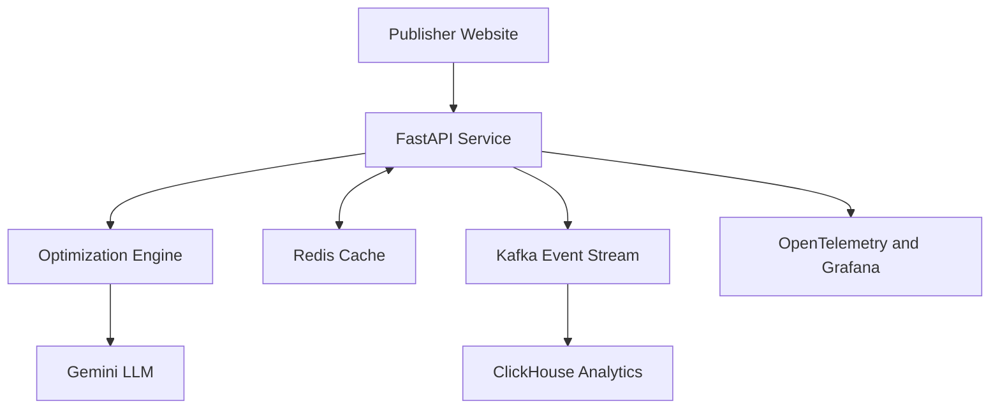

# AdStream Revenue Optimization Platform
## Architecture Decisions and Technical Rationale

**Document type:** Architecture Decision Record (ADR)  
**Project:** Ad Tech and Revenue Optimization Platform  
**Prepared by:** Cherwin N  
**Status:** Approved for Phase 2  
**Version:** 1.0  

## 1. Executive Summary

The AdStream Revenue Optimization Platform is a real-time, AI-assisted backend designed to improve advertisement viewability, placement quality and publisher revenue. The platform receives engagement information such as scroll depth, time on page, page identity and device type. It evaluates this information through an optimization engine, recommends an advertisement position and format, estimates viewability and RPM, and optionally generates a contextual explanation using the Gemini large language model.

The system adopts a modular service-oriented architecture. FastAPI exposes the REST interface, Redis supports low-latency caching, Apache Kafka transports ad events, ClickHouse stores analytical data, Gemini produces human-readable recommendations, Docker Compose manages infrastructure services, pytest validates behaviour, Locust measures performance, and OpenTelemetry/Grafana can provide production observability.

The architecture is designed around five enterprise priorities: low latency, horizontal scalability, loose coupling, operational visibility and graceful degradation.

## 2. Business Context

AdStream Analytics supports digital publishers handling high volumes of advertisement impressions. Publisher RPM has declined because of privacy changes, inefficient placements and latency. The current viewability rate is below the expected industry benchmark, while header-bidding delay increases page-load time and bounce rate.

The platform therefore aims to:

- Recommend positions that are more likely to become visible.
- Select suitable ad formats using engagement context.
- Reduce repeated computation through caching.
- Capture optimization events for later revenue analysis.
- Continue serving deterministic recommendations when the LLM is unavailable.
- Provide measurable performance and operational procedures.

## 3. High-Level Architecture

### Request flow

1. A publisher application submits engagement data to `POST /optimize-placement`.
2. Pydantic validates the request schema and rejects invalid values.
3. The API creates a deterministic cache key and checks Redis.
4. A cache hit returns a previously calculated recommendation quickly.
5. A cache miss invokes the rule-based optimization engine.
6. Gemini may generate a contextual reason for the recommendation.
7. If Gemini fails, the application retains the deterministic fallback reason.
8. The completed event is published asynchronously to Kafka.
9. A consumer can persist the event in ClickHouse for analytical reporting.
10. The API returns position, format, viewability, RPM, source, LLM usage and latency.

## 4. Architecture Principles

- **API-first design:** every business capability is exposed through a documented contract.
- **Graceful degradation:** optional dependencies must not make the core optimization endpoint unavailable.
- **Loose coupling:** Kafka separates online request processing from downstream analytics.
- **Stateless application layer:** FastAPI instances can be replicated behind a load balancer.
- **Fast data path:** Redis reduces repeated optimization and LLM calls.
- **Observability by design:** health, latency, failure rate and dependency status must be measurable.
- **Privacy-aware processing:** only required contextual and behavioural fields should be processed.
- **Configuration externalization:** credentials and environment-specific values must remain outside source code.

## 5. Architecture Decisions

### ADR-001: FastAPI as the API framework

**Decision:** Use FastAPI for health and optimization endpoints.

**Rationale:** FastAPI provides asynchronous request handling, OpenAPI documentation, type-driven validation and strong performance. Pydantic models reduce invalid input entering the optimization workflow.

**Benefits:** rapid development, automatic Swagger UI, clear request contracts and compatibility with Python AI libraries.

**Trade-offs:** blocking calls can reduce concurrency if they are not isolated; production deployment requires an ASGI server and multiple workers.

**Mitigation:** use timeouts for external services, avoid blocking work in the request path and deploy with an appropriate worker count.

### ADR-002: Redis for cache and dependency health

**Decision:** Cache repeated optimization responses in Redis with a controlled TTL.

**Rationale:** Redis provides in-memory access with very low latency. It reduces repeated rule evaluation and unnecessary LLM calls for equivalent input.

**Benefits:** faster response times, reduced external API cost and improved resilience.

**Trade-offs:** cached information can become stale, and Redis memory is finite.

**Mitigation:** configure TTL values, define eviction policies, monitor memory, version cache keys and treat Redis failure as non-fatal where possible.

### ADR-003: Apache Kafka for ad-event streaming

**Decision:** Publish completed optimization events to the `ad-events` topic.

**Rationale:** Kafka separates the synchronous API from analytics ingestion. It supports durable, scalable event processing and future consumers such as dashboards, alerting and ML pipelines.

**Benefits:** loose coupling, replayability, multiple consumers and high throughput.

**Trade-offs:** additional operational complexity, partitions and consumer lag must be managed, and delivery can be duplicated.

**Mitigation:** design consumers to be idempotent, monitor lag, use appropriate acknowledgement settings and define retention policies.

### ADR-004: ClickHouse for analytical storage

**Decision:** Store structured advertising events in ClickHouse.

**Rationale:** ClickHouse is optimized for columnar aggregation over large event datasets. It supports fast analysis of viewability, RPM, format, placement and latency trends.

**Benefits:** high ingestion throughput, compression and efficient analytical queries.

**Trade-offs:** it is not intended for transactional update-heavy workloads and requires careful schema and partition design.

**Mitigation:** use append-oriented event tables, batch inserts where suitable, retention policies and regular storage monitoring.

### ADR-005: Hybrid deterministic engine and Gemini LLM

**Decision:** Use deterministic rules for the core recommendation and Gemini for contextual explanation.

**Rationale:** Revenue recommendations require predictable behaviour. An LLM improves explanation quality but must not become a single point of failure.

**Benefits:** reliable decisions, richer explanations and business-readable output.

**Trade-offs:** LLM calls introduce cost, variable latency and potential unavailability.

**Mitigation:** apply strict timeouts, fallback messages, caching, input minimization and the `llm_used` field for transparency.

### ADR-006: Docker Compose for local infrastructure

**Decision:** Run Redis, Kafka and ClickHouse as version-pinned containers.

**Rationale:** Containers give developers a reproducible environment and simplify dependency startup.

**Benefits:** environment consistency, isolation and simpler onboarding.

**Trade-offs:** Docker consumes local resources and container networking can complicate debugging.

**Mitigation:** document ports and service names, configure health checks and pin tested image versions.

### ADR-007: Locust for performance testing

**Decision:** Use Locust to simulate concurrent traffic against `/health` and `/optimize-placement`.

**Rationale:** Locust scenarios are written in Python and can model realistic weighted behaviour using the same language as the backend.

**Benefits:** reusable tests, live statistics, percentile latency and distributed execution.

**Trade-offs:** results depend on the load-generator machine and test data; local tests do not fully represent production.

**Mitigation:** document the environment, repeat tests, preserve reports and compare results against defined targets.

## 6. Data Model

The main analytical event contains:

| Field | Purpose |
|---|---|
| `user_id` | Pseudonymous identifier used by the test workflow |
| `page_id` | Identifies the publisher page |
| `recommended_position` | Selected placement location |
| `ad_format` | Selected display/native format |
| `predicted_viewability` | Expected probability of visibility |
| `estimated_rpm` | Estimated revenue per thousand impressions |
| `source` | Engine or cache source |
| `llm_used` | Indicates whether Gemini produced the explanation |
| `latency_ms` | End-to-end processing latency |
| `event_time` | Event timestamp for time-series analysis |

## 7. Security and Privacy Decisions

- Secrets such as `GEMINI_API_KEY` must be stored in `.env` or a secret manager and excluded from Git.
- Request validation restricts malformed data and impossible scroll-depth values.
- Production traffic must use HTTPS through a reverse proxy or managed gateway.
- Logs must not expose API keys, tokens or unnecessary personal information.
- Rate limiting, authentication and authorization should protect non-public endpoints.
- Containers and Python packages should be regularly scanned and patched.
- A privacy retention policy should define how long behavioural events are stored.

## 8. Scalability and Reliability

FastAPI is stateless and can scale horizontally. Redis can be upgraded to a managed or replicated configuration. Kafka partitions allow event-stream parallelism, while ClickHouse can scale through sharding and replication. External calls must use timeouts and retry policies with backoff. Readiness checks should control whether an instance receives traffic, while graceful shutdown must allow active requests and producer buffers to complete.

## 9. Observability

The recommended operational signals are:

- Request volume and requests per second.
- Average, p95 and p99 response latency.
- HTTP 4xx and 5xx rates.
- Redis hit ratio, memory and connectivity.
- Kafka producer errors and consumer lag.
- ClickHouse insert failures and storage utilization.
- Gemini success, timeout and fallback rates.
- Application CPU, memory and worker utilization.

## 10. Risks and Future Improvements

Key risks include external LLM latency, cache inconsistency, Kafka backlog, analytics storage growth and traffic spikes. Future improvements include Kubernetes deployment, managed secrets, circuit breakers, authenticated APIs, schema registry, dead-letter topics, automated dashboards, CI/CD quality gates and ML-based viewability prediction.

## 11. Decision Outcome

The selected architecture provides a practical balance between development speed and enterprise readiness. The real-time path remains predictable, optional AI enriches explanations, and streaming infrastructure supports future analytics without tightly coupling it to the API.
