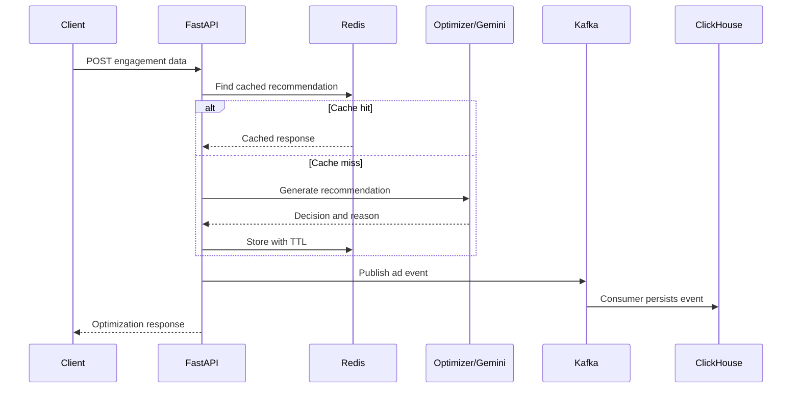

# AdStream Revenue Optimization Platform
## Knowledge Transfer and Handover Guide

**Prepared by:** Cherwin N  
**Audience:** Development, QA, DevOps and project reviewers  
**Version:** 1.0

## 1. Knowledge-Transfer Objective

This guide enables a new team member to understand, operate, test, troubleshoot and maintain the AdStream Revenue Optimization Platform without depending on its original developer. It explains business purpose, architecture, request flow, services, commands, testing evidence, operational ownership and recommended future work.

## 2. Business Problem and Solution

Digital publishers lose revenue when advertisements are placed outside the visible portion of a page or when advertising technology adds excessive latency. AdStream addresses this problem by analysing engagement signals and recommending a placement and format expected to improve viewability and RPM.

The submitted signals include page identity, scroll depth, time on page, device type and page type. The output contains a recommended position, format, predicted viewability, estimated RPM, reason, source, LLM-use indicator and processing latency.

## 3. System Components

| Component | Responsibility | Owner concern |
|---|---|---|
| FastAPI | REST endpoints and request orchestration | Availability, validation and latency |
| Pydantic | Request/response schemas | Contract compatibility |
| Optimization engine | Deterministic placement decision | Rule quality and explainability |
| Gemini | Contextual natural-language reason | Cost, timeout and fallback rate |
| Redis | Cached recommendations | Memory, TTL and hit ratio |
| Kafka | Event transport | Availability and consumer lag |
| ClickHouse | Analytical event storage | Insert health, disk and retention |
| Docker Compose | Local infrastructure lifecycle | Versions, health and networking |
| pytest | Automated functional/integration validation | Regression protection |
| Locust | Concurrent performance testing | Throughput, latency and failures |

## 4. End-to-End Flow



## 5. Repository Orientation

A representative structure is:

```text
Cherwin_project/
├── backend/app/             # FastAPI application and services
├── tests/                   # pytest test suite
├── docs/                    # architecture and operational documents
├── load-tests/              # Locust scenarios, if separated
├── screenshots/             # Test evidence
├── locustfile.py            # Locust scenario, if kept at root
├── docker-compose.yml       # Infrastructure definition
├── requirements.txt         # Python dependencies
├── .env.example             # Safe configuration template
└── README.md                # Entry-point documentation
```

## 6. API Contract

### `GET /`

Confirms the application is running and provides a basic service response.

### `GET /health`

Reports API health and Redis connectivity. In a mature deployment, liveness and readiness should be separate so an optional dependency does not incorrectly restart a healthy process.

### `POST /optimize-placement`

Example request:

```json
{
  "user_id": "demo_user",
  "page_id": "article_101",
  "scroll_depth": 65,
  "time_on_page": 45,
  "device_type": "desktop",
  "page_type": "article"
}
```

Example response shape:

```json
{
  "recommended_position": "middle_content",
  "ad_format": "native",
  "predicted_viewability": 0.94,
  "estimated_rpm": 5.76,
  "reason": "User engagement supports a visible in-content placement.",
  "source": "optimization_engine",
  "llm_used": true,
  "latency_ms": 120.5
}
```

Actual values depend on input, cache status and LLM availability.

## 7. How the Optimization Logic Works

The engine groups scroll behaviour into placement ranges. Low scroll depth favours positions near the top, medium engagement favours upper or middle content, and high scroll depth can support lower placements. Time on page modifies the viewability estimate because longer engagement increases the chance that an advertisement is seen. The engine then calculates an estimated RPM from the decision inputs.

This deterministic logic provides stable output. Gemini is used for explanation, not as the only decision maker. Therefore, an LLM error should set `llm_used` to false and return a safe fallback reason rather than failing the request.

## 8. Environment Setup

```bash
cd ~/Downloads/Telegram\ Desktop/Cherwin_project
python -m venv venv
source venv/bin/activate
python -m pip install -r requirements.txt
sudo docker compose up -d
sudo docker compose ps
```

Create `.env` from a safe example and enter required local values. Never share or commit the real API key.

Start the API:

```bash
uvicorn backend.app.main:app --reload
```

Open:

- API: `http://localhost:8000`
- Swagger UI: `http://localhost:8000/docs`
- Locust: `http://localhost:8089` after Locust starts

## 9. Functional Verification

```bash
curl http://localhost:8000/health
python -m pytest tests/ -v
```

Use Swagger UI to submit a valid optimization payload. Then test invalid scroll depth to confirm that validation rejects impossible values.

Verify dependencies:

```bash
sudo docker exec -it redis-adstream redis-cli PING
sudo docker compose logs --tail=100 kafka
sudo docker compose logs --tail=100 clickhouse
```

## 10. Performance Validation

```bash
locust -f locustfile.py --host http://localhost:8000
```

The existing workload calls `/health` with weight 1 and `/optimize-placement` with weight 3. Run the agreed user count and spawn rate for a fixed duration. Record request count, RPS, average, median, p95, p99, maximum latency and failure rate. Results belong in `docs/load-test-report.md` with screenshots.

Performance should be tested in at least two modes:

1. **Warm cache:** repeated payloads measure optimized steady-state performance.
2. **Cold or varied cache:** randomized payloads measure computation and LLM impact.

## 11. Monitoring and Alerting

Operational dashboards should track:

- Request volume and endpoint latency percentiles.
- HTTP 4xx/5xx counts and overall failure rate.
- Redis connectivity, memory, evictions and cache-hit ratio.
- Kafka publish failures and consumer lag.
- ClickHouse ingestion errors, disk space and query latency.
- Gemini call count, success rate, fallback rate and latency.
- Host/container CPU and memory.

Suggested alerts include sustained 5xx errors, p95 latency above target, Redis unavailable, Kafka lag increasing, ClickHouse disk nearing capacity and abnormal Gemini fallback rate.

## 12. Common Failure Scenarios

### Redis disconnected

Check the container and `PING`, validate the Redis URL, restart only Redis, and repeat `/health`. The API should preferably continue with non-cached processing.

### Gemini returns an error

Check whether the key is loaded, verify model name and quota, and inspect sanitized logs. The request should still succeed through deterministic fallback with `llm_used: false`.

### Kafka event is not published

Check broker status, bootstrap-server configuration and producer logs. Confirm the topic exists. Prevent a temporary analytics failure from causing a complete user-facing outage when business rules allow.

### ClickHouse authentication fails

Verify username, password, database and port without displaying secrets. Confirm the `adstream.ad_events` table exists and perform `SELECT 1`.

### Locust reports failures

Open the Failures tab, record error type and count, correlate timestamps with API logs, correct the root cause and rerun the same workload for a fair comparison.

## 13. Security Handover

- `.env` stays outside version control.
- `.env.example` contains names only, never real secret values.
- Validate and constrain every external field.
- Add authentication and role-based authorization for production use.
- Terminate TLS at a trusted proxy or gateway.
- Avoid logging raw identifiers and confidential payloads.
- Define event retention and deletion policies.
- Scan packages and images and patch supported versions.
- Restrict database and broker access to required networks.

## 14. Ownership and Responsibilities

| Activity | Recommended owner | Frequency |
|---|---|---|
| API health and error review | Backend/Operations | Daily |
| Kafka lag and ClickHouse ingestion | Data/Platform team | Daily |
| Redis memory and cache policy | Backend/Platform team | Weekly |
| Automated regression tests | QA/Developers | Every change |
| Load-test baseline | Performance/QA | Major release |
| Dependency and image updates | DevOps/Security | Monthly |
| Architecture/runbook review | Technical lead | Each major change |
| Backup restore test | Operations/Data team | Monthly/Quarterly |

## 15. Change and Release Process

1. Create a focused branch and document the intended change.
2. Implement code and update tests.
3. Run linting, automated tests and security checks.
4. Review API/schema compatibility.
5. Run smoke and load tests for performance-sensitive changes.
6. Merge after review and identify the release commit.
7. Deploy with a documented rollback option.
8. Monitor health, errors and latency after deployment.
9. Update this handover guide and the runbook if operations changed.

## 16. Knowledge-Transfer Session Agenda

Recommended 30–45 minute session:

1. Business problem and success metrics – 5 minutes.
2. Architecture and request flow – 8 minutes.
3. Live service startup and Swagger demonstration – 8 minutes.
4. Redis, Kafka and ClickHouse verification – 7 minutes.
5. pytest and Locust results – 7 minutes.
6. Incident recovery and responsibilities – 5 minutes.
7. Questions and participant validation – 5 minutes.

## 17. Participant Validation Checklist

After the session, a new team member should be able to:

- Explain the purpose of each component.
- Start the infrastructure and API.
- Call the health and optimization endpoints.
- Run the automated test suite.
- Execute and interpret a Locust test.
- Locate logs and diagnose common dependency failures.
- Explain the deterministic fallback when Gemini is unavailable.
- Identify security, backup and maintenance responsibilities.

## 18. Current Status and Future Roadmap

The Phase 2 platform demonstrates integrated API, cache, event streaming, analytical storage, LLM assistance, automated tests and load testing. Recommended next improvements are production authentication, CI/CD, managed secrets, multiple workers, structured tracing, Grafana dashboards, dead-letter handling, idempotent consumers and ML-based viewability prediction trained on real event outcomes.

## 19. Handover Sign-Off

| Item | Evidence | Status |
|---|---|---|
| Architecture decisions | `docs/architecture-decisions.md` | Complete |
| Operational procedures | `docs/operational-runbook.md` | Complete |
| Load-test analysis | `docs/load-test-report.md` | Complete after metrics are entered |
| Automated tests | pytest terminal output | Verified by project team |
| Knowledge-transfer session | Attendance/feedback record | `<ENTER STATUS>` |

The handover is complete when the receiving team has reviewed the documents, successfully started the platform, executed a test request and confirmed ownership of ongoing operational activities.
